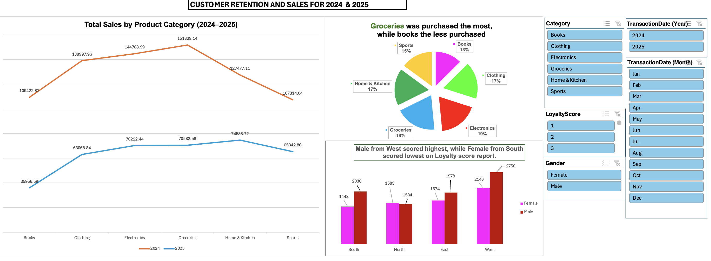

# 🛍️ Capstone 1 – Customer Retention Analytics



An **end-to-end retail analytics project** combining **data preparation**, **SQL-based analytics**, and an **Excel dashboard**.  
Developed as part of the Certified Data Analysts program, this project focuses on **customer retention insights** and **sales optimization**.

---

## 📜 Project Description
This repository contains **Capstone Project 1** for the Certified Data Analysts program, focusing on **retail customer retention analytics** using SQL and Excel. The project demonstrates skills in **data modeling, cleaning, querying, and visualization** to produce actionable business insights.

The project begins with designing a **normalized relational database schema** containing four key entities: `Customers`, `Products`, `Campaigns`, and `Transactions`. Data is imported from CSV files, cleaned, and transformed — including converting transaction dates into proper MySQL `DATE` format — to ensure accurate time-based analyses.

Using **structured SQL queries**, the analysis identifies:  
- **Top 10 customers by revenue** to pinpoint high-value clients.  
- **Repeat vs one-time customers** to assess loyalty patterns.  
- **Monthly revenue trends** to monitor sales performance over time.  
- **Customer Lifetime Value (LTV)** to measure long-term profitability.

An **interactive Excel dashboard** complements the SQL analysis, allowing stakeholders to explore insights visually. Features include KPI cards for revenue, retention rate, and top customers; charts for monthly sales and product performance; and slicers for filtering by region, product, or campaign.

---

## 📂 Repository Structure

```
capstone1-customer-retention/
├─ data/ # CSV datasets (replace with synthetic if confidential)
│ ├─ customers.csv
│ ├─ products.csv
│ ├─ transactions.csv
│ └─ campaigns.csv
├─ excel/ # Excel workbook + dashboard
│ └─ CDA_Capstone1_Complete_NazreenAgos.xlsx
├─ sql/ # SQL scripts
│ ├─ 01_Create_Tables.sql
│ ├─ 02_Customer_Retention_Queries.sql
│ └─ 03_Data_Cleaning_TransactionDate.sql
├─ reports/ # PDF write-ups & capstone instructions
│ ├─ Certified-Data-Analysts-Capstone-Project-Part-1.pdf
│ └─ CDA-Capstone1-Nazreen-Agos.pdf
├─ images/ # Screenshot
│ └─ dashboard.png
├─ .gitignore
├─ LICENSE
└─ README.md
```

---

## 🗄️ Tables Created
- **Customers** – Customer info, loyalty score, region, signup date.  
- **Products** – Product details, category, price, supplier.  
- **Campaigns** – Marketing campaign details, target audience, conversions.  
- **Transactions** – Purchase details: quantity, discount, total price, transaction date.  

---

## 🧹 Data Cleaning
**File:** `sql/03_Data_Cleaning_TransactionDate.sql`  
Converts text-based dates (`MM/DD/YYYY`) into MySQL `DATE` format to enable accurate monthly and yearly trend analysis.

---

## 📊 Key Analyses
**File:** `sql/02_Customer_Retention_Queries.sql`  
Includes:
- Top 10 Customers by Revenue  
- Repeat vs One-Time Customers  
- Monthly Revenue Trends  
- Customer Lifetime Value (LTV)  

---

## 📈 Excel Dashboard
**File:** `excel/CDA_Capstone1_Complete_NazreenAgos.xlsx`  

**Features:**
- KPI cards for revenue, retention rate, and top customers.  
- Monthly revenue time-series chart.  
- Repeat vs one-time customer segmentation.  
- Product performance ranking by revenue and quantity sold.  
- Interactive slicers for filtering by product, region, or campaign.
